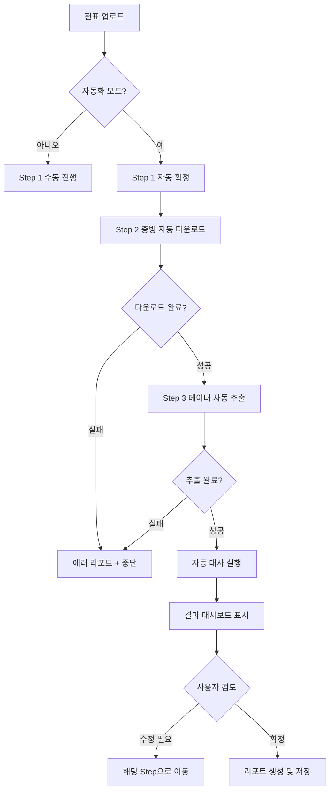

# IDARS 프로젝트 전반 개선 계획서

## 📋 개요

본 문서는 IDARS(Invoice Data Analysis & Reconciliation System) 프로젝트의 MVP 완성 이후 전반적인 구조 개선 계획을 담고 있습니다. 목표는 프로젝트 구조를 **더 단단하고, 명확하며, 신속한** 방향으로 개선하는 것입니다.

### 현재 상태
- ✅ MVP 완성
- 현재 워크플로우: Step 1 → Step 2 → Step 3 → Step 4
- 메인 워크스페이스 존재
- 수동 설정 방식
- 단계별 수동 진행

### 개선 목표
- 🎯 명확한 3단계 워크플로우
- 🎯 설정의 중앙화 및 간편화
- 🎯 완전 자동화 기능 제공
- 🎯 직관적인 UI/UX

---

## 📦 개선 사항

### 1️⃣ Step 2: 증빙 다운로드 모듈 개선

#### 배경
SAP ERP에서 특정 매출전표(Billing)의 증빙 문서를 대량으로 다운로드하는 자동화 스크립트의 성능 및 안정성 개선이 필요합니다.

#### 주요 개선 사항

##### 1.1. 로직 단순화 및 오류 제거

**문제점**
- 전표 번호 길이에 따른 Transaction 자동 감지 로직이 부정확
- 매입(LIV) 로직이 혼재되어 오류 발생 빈도가 높음

**개선 방안**
- ❌ 복잡한 `detect_transaction_type` 및 `TRANSACTION_CONFIG` 제거
- ✅ 오직 매출전표(ZSDR0390) 처리 프로세스로 고정하여 안정성 확보

##### 1.2. 처리 속도 비약적 향상 (Smart Wait 도입)

**문제점**
- `time.sleep(1.0)` 등 고정된 대기 시간 사용
- 시스템 반응이 빨라도 무조건 정해진 시간을 기다려야 함
- 대량 처리 시 시간 손실 누적

**개선 방안**
- ✅ `smart_wait` 함수 구현
  - 0.1초 간격으로 화면 요소 감지
  - 요소가 로딩되는 즉시 다음 단계로 진행
  - 반응 속도가 빠른 환경에서 건당 처리 시간 획기적 단축

##### 1.3. 완전 자동화 구현 (Auto-Login)

**문제점**
- SAP가 실행되어 있지 않거나 로그아웃 상태일 경우 스크립트 실행 불가

**개선 방안**
- ✅ SAP GUI 프로세스 실행 여부 감지
- ✅ 미실행 시 자동으로 `saplogon.exe` 호출
- ✅ ID/PW 자동 입력하여 로그인 후 작업 시작

##### 1.4. SAP 보안 팝업 이슈 해결

**이슈**
- 스크립트 실행 시 "스크립트가 SAP GUI에 액세스하려고 합니다" 보안 경고 팝업 발생

**해결 방안**
1. SAP Logon 화면 → 옵션(Options) 클릭 (Alt+F12)
2. 접근성 및 스크립트 → 스크립트 메뉴 이동
3. "스크립트가 SAP GUI에 연결될 때 알림" 체크 해제

---

### 2️⃣ 운영 전반: 워크플로우 재구성

#### 현재 구조
```
Step 1 (전표 확인) → Step 2 (증빙 수집) → Step 3 (데이터 추출) → Step 4 (자동 대사)
```

#### 개선된 구조
```
Step 1 (전표 확인) → Step 2 (증빙 수집) → Step 3 (데이터 추출 및 대사) → 결과 대시보드

#### 주요 변경 사항
1. **Step 4 삭제**: Step 3에 대사 기능 통합
2. **결과 대시보드 연결**: Step 3 완료 후 바로 결과 확인
3. **명확한 단계 구분**: 각 단계의 역할 명확화

#### 각 단계별 역할

| 단계 | 역할 | 주요 기능 |
|------|------|-----------|
| **Step 1** | 전표 확인 및 승인 | - 로컬/SAP에서 전표 데이터 업로드<br>- 전표 데이터 검증 및 편집<br>- 데이터 확정 |
| **Step 2** | 증빙 문서 수집 | - SAP DMS에서 증빙 자동 다운로드<br>- 증빙 문서 관리 및 확인 |
| **Step 3** | 데이터 추출 및 대사 | - PDF에서 데이터 자동 추출<br>- 전표 vs 증빙 데이터 대사<br>- 차이 분석 및 확정 |
| **결과 대시보드** | 최종 결과 확인 | - 대사 결과 통계<br>- 불일치 항목 리포트<br>- 데이터 내보내기 |

---

### 3️⃣ Step 4 삭제 및 사이드바 개선

#### 삭제 대상
- ✅ Step 4 뷰 컴포넌트
- ✅ Step 4 API 엔드포인트
- ✅ 사이드바 Step 4 메뉴 항목

#### 사이드바 최종 구조
```
🏠 홈
📊 Step 1: 전표 확인
📁 Step 2: 증빙 수집
📝 Step 3: 데이터 추출 및 대사
📈 결과 대시보드
⚙️  설정
```

---

### 4️⃣ Step 3 → 결과 대시보드 연결

#### 구현 내용

##### 4.1. Step 3 완료 플로우
```
Step 3 데이터 확정 → 자동 대사 실행 → 결과 저장 → 대시보드로 이동
```

##### 4.2. 결과 대시보드 기능

**통계 섹션**
- 전체 전표 수
- 일치 건수 / 불일치 건수
- 정확도 (%)
- 총 금액 차이

**상세 테이블**
- 전표번호별 대사 결과
- 불일치 항목 상세 (금액, 날짜, 공급자 등)
- 필터링 및 검색 기능

**액션**
- Excel 내보내기
- PDF 리포트 생성
- Step 1/2/3로 돌아가기 (수정)

---

### 5️⃣ 설정 사이드바 신설

#### 배경
현재는 코드에 하드코딩되거나 별도 설정 파일을 수동으로 편집해야 하는 불편함이 있습니다.

#### 설정 항목

##### 5.1. 프로젝트 설정
- **기본 저장 폴더**: 프로젝트 데이터 저장 경로
- **임시 파일 폴더**: 임시 파일 저장 경로
- **백업 설정**: 자동 백업 주기 및 경로

##### 5.2. SAP 연동 설정
- **SAP 서버**: 연결할 SAP 서버 주소
- **SAP 클라이언트**: 클라이언트 번호
- **SAP 사용자 ID**: 자동 로그인용 ID
- **SAP 비밀번호**: 암호화 저장
- **SAP GUI 경로**: saplogon.exe 위치

##### 5.3. API 설정
- **Gemini API 키**: PDF 데이터 추출용 API 키
- **API 사용량 제한**: 월별/일별 사용량 상한
- **추출 모드 기본값**: Basic / Detailed

##### 5.4. UI 설정
- **언어**: 한국어 / 영어
- **테마**: Light / Dark
- **폰트 크기**: 작게 / 보통 / 크게

#### 설정 저장 구조

**Backend: `config/settings.json`**
```json
{
  "project": {
    "default_save_path": "D:/IDARS_Projects",
    "temp_path": "D:/IDARS_Projects/temp",
    "auto_backup": true,
    "backup_interval": 24
  },
  "sap": {
    "server": "SAP_SERVER_NAME",
    "client": "100",
    "user_id": "ENCRYPTED_ID",
    "password": "ENCRYPTED_PASSWORD",
    "gui_path": "C:/Program Files (x86)/SAP/FrontEnd/SAPgui/saplogon.exe"
  },
  "api": {
    "gemini_api_key": "ENCRYPTED_KEY",
    "monthly_limit": 10000,
    "default_mode": "basic"
  },
  "ui": {
    "language": "ko",
    "theme": "light",
    "font_size": "medium"
  }
}
```

#### 설정 UI 구조

**설정 화면 탭 구성**
1. 📁 프로젝트 설정
2. 🔌 SAP 연동
3. 🔑 API 설정
4. 🎨 UI 설정

**주요 기능**
- ✅ 설정 변경 즉시 미리보기
- ✅ 설정 저장 버튼
- ✅ 기본값으로 초기화
- ✅ 설정 가져오기/내보내기
- ✅ 연결 테스트 (SAP, API)

---

### 6️⃣ 메인 워크스페이스 제거

#### 현재 상황
- `MotherWorkspace` 컴포넌트가 존재하나 실질적인 활용도가 낮음
- 사용자가 홈에서 바로 Step으로 이동 가능

#### 개선 방안
- ✅ `MotherWorkspace` 컴포넌트 제거
- ✅ 홈 화면에서 프로젝트 선택 시 바로 Step 1로 이동
- ✅ 프로젝트 개요는 각 Step 상단 헤더에 통합

#### 새로운 홈 화면 구조
```
홈 화면
├── 새 프로젝트 시작
│   ├── 로컬 파일 업로드
│   └── SAP 직접 연동
├── 최근 프로젝트 (5개)
│   └── 클릭 시 → Step 1으로 바로 이동
└── 모든 프로젝트 보기
    └── 모달 → 프로젝트 선택 → Step 1
```

---

### 7️⃣ 전체 자동화 설계

#### 목표
전표 업로드만으로 Step 1 → Step 2 → Step 3 → 결과 대시보드까지 완전 자동 실행

#### 자동화 플로우



#### UI 구성

##### 7.1. 자동화 시작 버튼
**위치**: Step 1 상단

**버튼 구성**
```
[🚀 전체 자동 실행] (Primary Button)
  ↓ 클릭 시 모달 표시
```

**확인 모달**
```
┌─────────────────────────────────────────┐
│  전체 자동 실행 확인                     │
├─────────────────────────────────────────┤
│                                          │
│  다음 작업이 자동으로 실행됩니다:        │
│  ✓ Step 1: 전표 데이터 확정             │
│  ✓ Step 2: SAP에서 증빙 자동 다운로드   │
│  ✓ Step 3: 데이터 자동 추출 및 대사     │
│  ✓ 결과 대시보드 생성                   │
│                                          │
│  예상 소요 시간: 약 15-30분             │
│  (전표 수에 따라 달라질 수 있습니다)    │
│                                          │
│  [취소]  [실행]                          │
└─────────────────────────────────────────┘
```

##### 7.2. 자동화 진행 상태 표시

**진행 화면**
```
┌─────────────────────────────────────────┐
│  자동 실행 중...                         │
├─────────────────────────────────────────┤
│                                          │
│  ✅ Step 1: 전표 확정 완료 (3초)        │
│  🔄 Step 2: 증빙 다운로드 중... 45/120  │
│     ▓▓▓▓▓▓▓▓▓░░░░░░░  37%              │
│  ⏳ Step 3: 대기 중                      │
│  ⏳ 결과 생성: 대기 중                   │
│                                          │
│  전체 진행률: ▓▓▓▓░░░░░░  20%           │
│                                          │
│  [중단]                                  │
└─────────────────────────────────────────┘
```

##### 7.3. 자동화 완료/에러 처리

**성공 시**
```
┌─────────────────────────────────────────┐
│  ✅ 자동 실행 완료!                      │
├─────────────────────────────────────────┤
│                                          │
│  소요 시간: 18분 32초                    │
│                                          │
│  ✓ Step 1: 120건 확정                   │
│  ✓ Step 2: 120건 다운로드 완료          │
│  ✓ Step 3: 118건 추출 성공, 2건 실패    │
│  ✓ 대사 완료: 일치 115건, 불일치 3건    │
│                                          │
│  [결과 대시보드 보기]  [확인]            │
└─────────────────────────────────────────┘
```

**에러 시**
```
┌─────────────────────────────────────────┐
│  ⚠️  자동 실행 중 오류 발생              │
├─────────────────────────────────────────┤
│                                          │
│  Step 2에서 오류가 발생했습니다:        │
│                                          │
│  SAP 연결 실패                          │
│  - SAP GUI가 실행되지 않았습니다        │
│  - 설정에서 SAP 정보를 확인하세요       │
│                                          │
│  진행 상황:                              │
│  ✓ Step 1: 완료                         │
│  ✗ Step 2: 실패 (45/120 다운로드)       │
│                                          │
│  [설정으로 이동]  [Step 2에서 재개]      │
└─────────────────────────────────────────┘
```

#### Backend API 구조

##### 7.4. 자동화 엔드포인트

**POST** `/api/projects/{project_id}/automate`

**Request Body**
```json
{
  "steps": [1, 2, 3],
  "options": {
    "skip_confirmation": false,
    "extraction_mode": "basic",
    "auto_navigate_to_dashboard": true
  }
}
```

**Response** (SSE - Server-Sent Events)
```json
{
  "type": "progress",
  "step": 2,
  "status": "running",
  "current": 45,
  "total": 120,
  "message": "증빙 다운로드 중..."
}
```

```json
{
  "type": "complete",
  "summary": {
    "step1": {"status": "success", "count": 120},
    "step2": {"status": "success", "downloaded": 120},
    "step3": {"status": "success", "extracted": 118, "failed": 2},
    "reconciliation": {"matched": 115, "unmatched": 3}
  },
  "duration": 1112
}
```

```json
{
  "type": "error",
  "step": 2,
  "error": "SAP connection failed",
  "details": "SAP GUI is not running",
  "can_resume": true
}
```

##### 7.5. 중단 및 재개 기능

**POST** `/api/projects/{project_id}/automate/pause`
- 현재 단계 완료 후 일시 중지

**POST** `/api/projects/{project_id}/automate/resume`
- 중단된 지점부터 재개

**DELETE** `/api/projects/{project_id}/automate`
- 자동화 완전 중단 및 롤백 옵션

---

## 🔄 마이그레이션 계획

### Phase 1: 구조 개선 (1-2일)
1. ✅ Step 4 제거
2. ✅ 사이드바 재구성
3. ✅ MotherWorkspace 제거
4. ✅ Step 3 → 대시보드 연결

### Phase 2: 설정 시스템 (2-3일)
1. ✅ 설정 데이터 모델 설계
2. ✅ 설정 UI 구현
3. ✅ Backend 설정 API 구현
4. ✅ 암호화/복호화 로직
5. ✅ 기존 코드에 설정 적용

### Phase 3: 자동화 기능 (3-4일)
1. ✅ 자동화 플로우 설계
2. ✅ Backend 자동화 API 구현 (SSE)
3. ✅ Frontend 자동화 UI 구현
4. ✅ 에러 처리 및 재개 로직
5. ✅ 테스트 및 안정화

### Phase 4: Step 2 개선 (1-2일)
1. ✅ Smart Wait 로직 구현
2. ✅ Auto-Login 기능 구현
3. ✅ 로직 단순화 (Billing 전용)
4. ✅ 테스트 및 검증

### Phase 5: 통합 테스트 및 문서화 (1-2일)
1. ✅ End-to-End 테스트
2. ✅ 사용자 가이드 작성
3. ✅ API 문서 업데이트
4. ✅ 배포 준비

**총 예상 기간**: 8-13일

---

## 📊 기대 효과

### 성능 개선
- ⚡ Step 2 다운로드 속도 50% 향상 (Smart Wait)
- ⚡ 전체 프로세스 자동화로 작업 시간 80% 단축
- ⚡ 사용자 개입 최소화

### 사용성 개선
- 👥 명확한 3단계 워크플로우로 학습 곡선 감소
- 👥 중앙 설정으로 초기 설정 시간 90% 단축
- 👥 자동화 기능으로 반복 작업 제거

### 유지보수성 개선
- 🔧 Step 4 제거로 코드 복잡도 감소
- 🔧 설정 중앙화로 변경 포인트 명확화
- 🔧 명확한 단계 구분으로 디버깅 용이

---

## ✅ 다음 단계

1. **검토 및 피드백**: 이 개선 계획서 검토
2. **우선순위 결정**: 어느 Phase부터 시작할지 결정
3. **세부 구현 계획**: 선택된 Phase에 대한 상세 구현 계획 수립
4. **개발 착수**: 단계별 개발 및 테스트 진행

---

**문서 버전**: 1.0
**작성일**: 2025-12-05
**상태**: 검토 대기 중